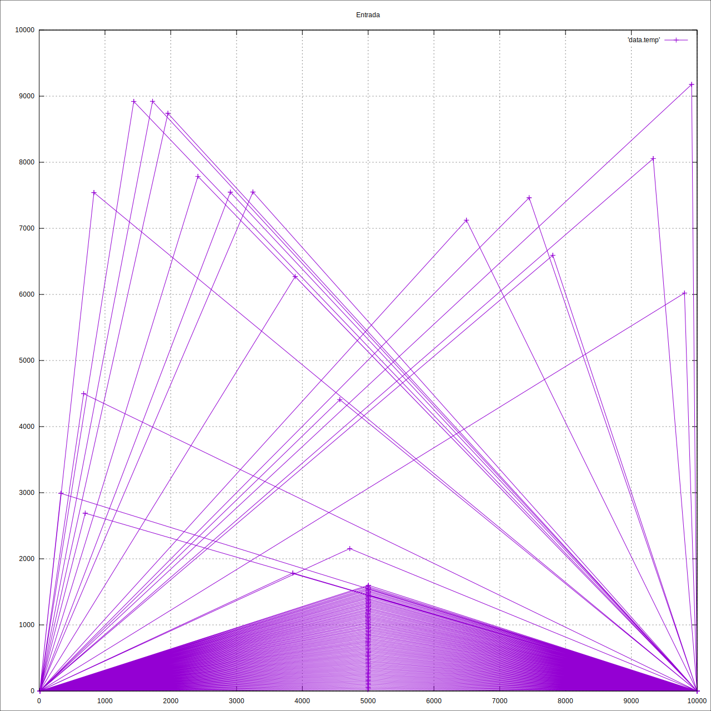

# Hipercampos

Primeiro Trabalho Prático de AED's III.



## Pre-requisitos

* Gnuplot [http://www.gnuplot.info/](http://www.gnuplot.info/)

## Instalando/Removendo

Instalando:

```cmd
make
```

Removendo:

```cmd
make clean
```

## Executando

```cmd
./hcamp -i input -o output
```

## Built With

* [Visual Studio Code](https://code.visualstudio.com/) - code editor
* [Xcode](https://developer.apple.com/xcode/) - IDE

## Versões

Ver [CHANGELOG](CHANGELOG.md) para mais detalhes.

## Autor

* **Pablo C.** - *need more coffee* - [Durfan](https://github.com/Durfan)
* **AlexRoncalli** - - [AlexRoncalli](https://github.com/AlexRoncalli)

## Licença

MIT License - ver [LICENSE](LICENSE) para mais detalhes.
